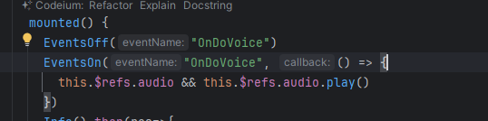
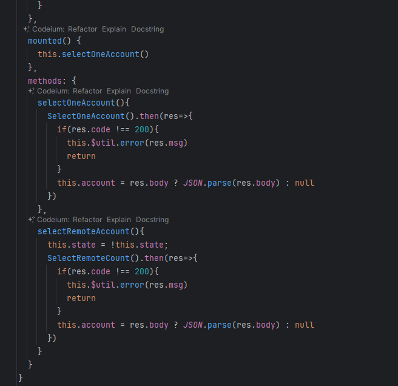
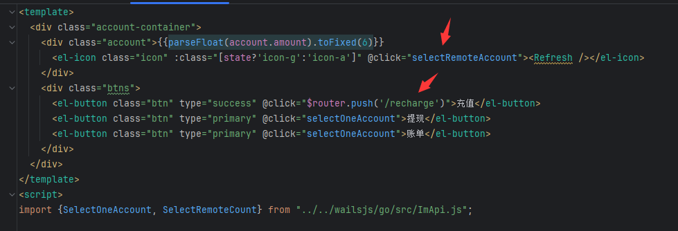
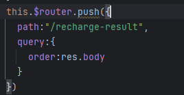
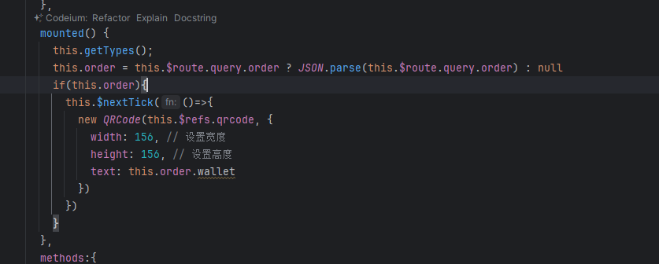
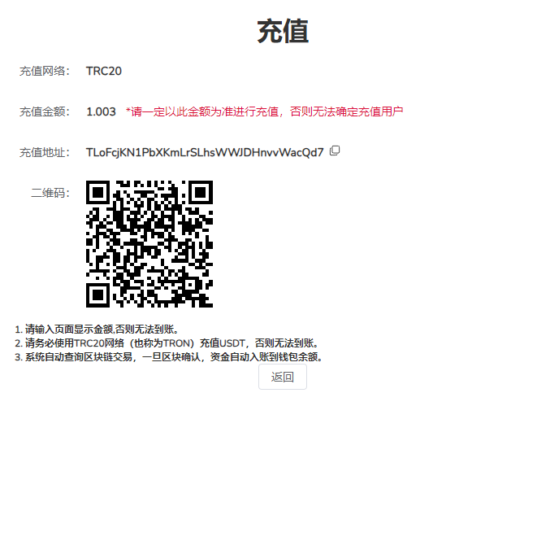

1. 增加事件 用于播放声音，类似微信新消息提示 OnDoVoice

2. 增加账户模块、充值模块
SelectOneAccount--缓存中获取数据,SelectRemoteCount--服务器获取数据

3. 充值页面
GetRechargeTypes--获取支付网络 AddRechargeOrder--添加充值订单，方法调用后会返回订单信息,返回订单信息后跳入下一个充值页

4. 充值页2解析参数并显示

